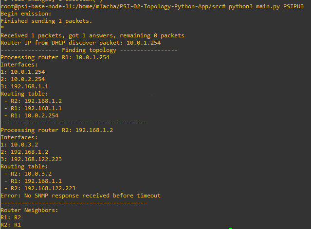
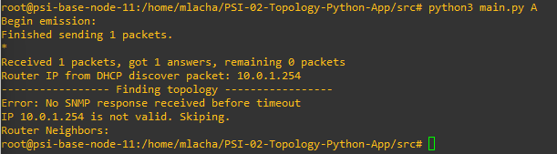
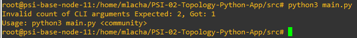

# PSI-02-Topology-Python-App

Aplikace analyzuje topologii sítě ve které se nachází zařízení na kterém je program spuštěn.

## Zadání
### Popis
Implementujte aplikaci v programovacím jazyce Python, která automaticky zjistí
topologii sítě, v které se nachází. Aplikace ke zjištění topologie využívá protokol
SNMP, pomocí kterého získá ze směrovačů obsah směrovacích tabulek.

Nejprve pomocí DHCP získá adresu výchozího směrovače, adresy dalších směrovačů
pak rekuzivním způsobem z obsahu směrovacích tabulek jednotlivých směrovačů. Je
nutné si uvědomit, že směrovač má zpravidla více rozhraní a je tedy identifikován
více IP adresami.

Relevantní SNMP objekty týkající směrovací tabulky, rozhraní a IP adres směrovače
najdete v dokumentu [RFC-1213](https://bestmonitoringtools.com/mibdb/mibdb_search.php?mib=RFC1213-MIB). 

### Technické podmínky
- K implementaci použijte referenční GNS3 projekt, který je dostupný na
adrese: https://home.zcu.cz/~maxmilio/PSI/psi-example-project1.gns3project. Lze jej snadno naimportovat do GNS3 přes funkci „File/Import
portable project“.
- Aplikaci implementujte v programovacím jazyce Python (verze 3) pomocí
knihoven Scapy (https://scapy.net/) a PySNMP
- Aplikace bude zveřejněna ve veřejném repozitáři na GitHub tak, aby ji bylo
možné na libovolném uzlu psi-base-node-* naklonovat a spustit.
- Všechny potřebné knihovny a nástroje jsou již předinstalovány v GNS3
appliance „psi-base-node“. 

## Požadavky
- Git
- Python 3.0 a vyšší
- pip
- snmp

## Implementace

Z uzlu kde bude program spuštěn se získá adresa routeru. Z tohoto routeru se získají informace o sousedních routerech, které se zařadí do fronty routerů, které mají být ještě zpracovány. Jednou zpracované routery se uloží do seznamu aby nebyly zpracovány dvakrát. Při zpracování každého routeru se budou ukládat seznamy sousedících routerů.

### IP adresa routeru
Pro získání IP routeru program pošle DHCP požadavek a z odpovědi získá IP adresu routeru.

```Python
response = dhcp_request()
# Process the DHCP response packets
dhcp_options = response['DHCP'].options
    for option in dhcp_options:
        if isinstance(option, tuple) and option[0] == 'router':
            router_ip = option[1]
```

### Routovací tabulka
Pro získání routovací tabulky je potřeba IP adresu routeru na kterou se pošle SNMP požadavek pro získání IP adres rozhraní routeru a IP adresy tzv **NextHop**. Pro získání adres odpovídá ID objektu "1.3.6.1.2.1.4.21.1".

```Python
var_binds = nextCmd(SnmpEngine(), 
    CommunityData(community), 
    UdpTransportTarget((router_ip, 161)),
    ContextData(),
    #ObjectType(ObjectIdentity('SNMPv2-MIB', 'sysName', 0)))
    ObjectType(ObjectIdentity('1.3.6.1.2.1.4.21.1')),
    lexicographicMode=False)

for var_bind in var_bind_table:
    oid = var_bind[0]
    # Process each entry in the routing table
    if str(oid).startswith('1.3.6.1.2.1.4.21.1.7'):  # OID for routing table entry
        route_entry = f"{var_bind[-1].prettyPrint()}"
        routing_table.add(route_entry)
```

### IP adresy rozhraních routeru
Stejným způsobem jako se získala data z routovací tabulky je možné získat ještě IP adresy rozhraních routeru. ID objektu odpovídá OID "1.3.6.1.2.1.4.20.1.1"

```Python
def get_interface_ips(ip):
    index = 1
    router_interfaces = set()
    print(f"Interfaces:")
    for (errorIndication,errorStatus,errorIndex,varBinds) in nextCmd(SnmpEngine(),
        CommunityData(community), UdpTransportTarget((ip, 161)), ContextData(),
        ObjectType(ObjectIdentity('1.3.6.1.2.1.4.20.1.1')), lexicographicMode=False):
        if errorIndication:
            print(errorIndication, file=sys.stderr)
            break
        elif errorStatus:
            print('%s at %s' % (errorStatus.prettyPrint(),
                                errorIndex and varBinds[int(errorIndex) - 1][0] or '?'),
                                file=sys.stderr)
            break
        else:
            for varBind in varBinds:
                print(f"{index}: {varBind[1].prettyPrint()}")
                router_interfaces.add(varBind[1].prettyPrint())
                index = index + 1
    return router_interfaces
```

### Hostname routeru
Abychom na výstup vypsali nejen IP adresy jednolivých routerů, získáme ještě navíc název routeru. Název routeru se získá z objektu s OID "1.3.6.1.2.1.1.5.0"

```Python
def snmp_get_hostname(ip):
    error_indication, error_status, error_index, var_binds = next(
            getCmd(SnmpEngine(),
                CommunityData(community),
                UdpTransportTarget((ip, 161)),
                ContextData(),
                ObjectType(ObjectIdentity('1.3.6.1.2.1.1.5.0')))
        )
    if error_indication:
        print(f"Error: {error_indication}")
        return None
    elif error_status:
        print(f"Error: {error_status.prettyPrint()} at index {error_index and var_binds[int(error_index) - 1][0] or '?'}")
        return None
    else:
        for var_bind in var_binds:
            hostname = f"{var_bind[-1].prettyPrint()}"
            return hostname
    return None
```

## Uživatelská příručka
### Instalace
Všechny příkazy potřebné pro instalaci nástrojů jsou k nalezení v souboru **init.sh**.
Nejprve je potřeba aktualizovat systém:

```bash
apt-get update
```

Dále je potřeba naistalovat nástroj pro práci s Gitem:

```bash
apt-get install -y git
```

Z Gitu se naklonuje repozitář s projektem do Vámi zvoleného adresáře pomocí příkazu:

```bash
git clone https://github.com/martinlacha/PSI-02-Topology-Python-App.git
```

Dále je potřeba nástroj **pip** pro instalaci závislostí projektu:

```bash
apt-get install -y pip
```

Pro instalaci knihoven použitých v aplikaci složí příkaz:

```bash
pip install -r requirements.txt
```

### Spuštění aplikace
Pro spuštění aplikace složí následující příkaz:
```bash
python3 main.py <COMMUNITY_STRING>
```
**COMMUNITY_STRING** - ID které musí být **read_only** na routerech pro získání informací z daného routeru

### Ukázky

#### Běh programu


#### Nevalidní COMMUNITY_STRING:


#### Nekompletní příkaz


## Odkazy
[Python](https://www.python.org/)

[Scapy](https://scapy.net/)

[SNMP library for Python](https://pysnmp.readthedocs.io/en/latest/)

[OID reference database](https://oidref.com/)

[Markdown Guide](https://www.markdownguide.org/getting-started/)

[SNMP](https://cs.wikipedia.org/wiki/Simple_Network_Management_Protocol)

